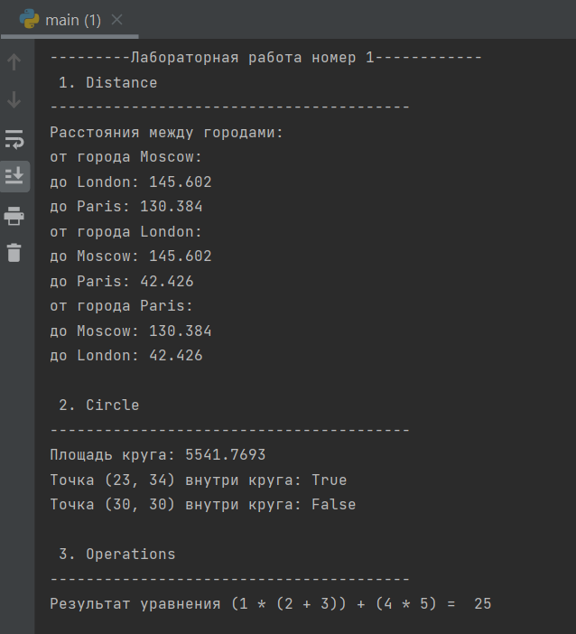
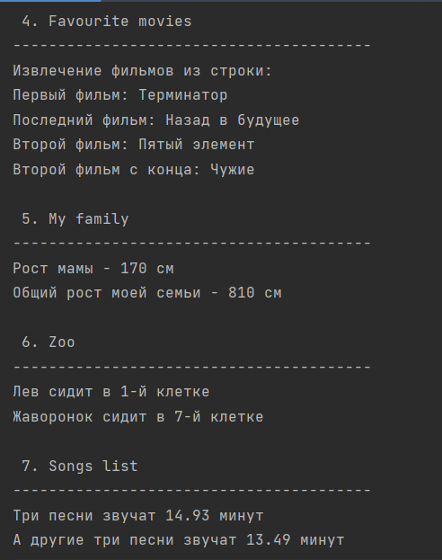
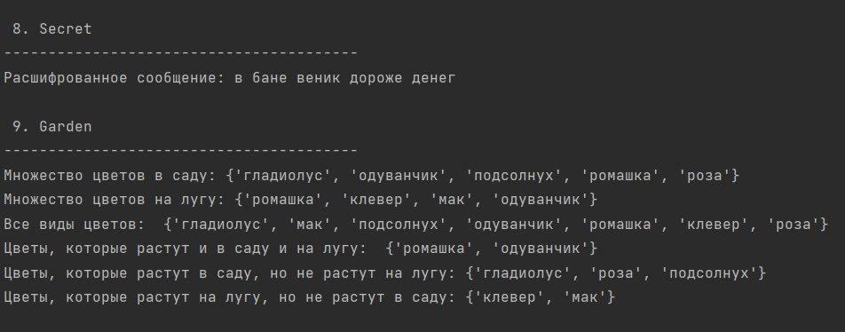
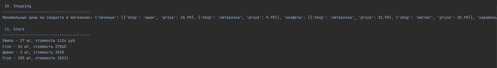

##Лабораторная работа №1. Введение в язык программирования Python

_Проект содержит в себе 11 различных модулей, демонстрирующих
работу с основными структурами данных, строками, словарями и базовыми
операциями. Верхуровневый модуль main.py объединяет все 
функции в единую программу, использует логику заданий и выводит результат._

## Задания
1. Используя словарь расстояний, рассчитать растояние на координатной сетке между городами, используя формулу и координаты
2. Проверить, лежат ли точки внутри круга и посчитать площадь, зная радиус
3. написать формулу для 1 2 3 4 5, используя "+", "-", "*", чтобы получилось 25 и вывести значение на консоль
4. Из данной строки с названиями фильмов выборочно вывести данные на консоль с использованием индексации строки
5. Создать списки семьи и приблизительного роста каждого члена семьи, а затем посчитать рост отдельного члена семьи и общий рост всех членов семьи
6. Добавить элемент 'bear' в список, добавить элементы из другого списка birds, удалить элемент списка 'elephant' и с помощью индексации посмотреть, в какой клетке сидит 'lion' и 'lark'
7. Из списка песен необходимо извлечь длину звучания и  распечатать общее время звучания трех песен. То же самое проделать со словарём.
8. Расшифровать сообщение, применяя срезы 
9. Работа с множествами: создать множества цветов, выбрать: все виды цветов, которые растут и там и там, которые растут только в саду, которые растут только на лугу
10. Работа со словарём магазинов: создать словарь цен на продукты
11. Рассчитать на какую сумму лежит каждого товара на складе. Вывести стоимость каждого вида товара на складе.

##Описание проделанной работы
В данной лабораторной работе была решена каждая задача. Основные темы, которые были затронуты - темы
списков, словарей, базовых конструкций, операций, индексация, срезы. 

###Задание 1:
Была изучена задача расчёта расстояний между городами на координатной плоскости , создан словарь с координатами трёх городов (Москва, Лондон, Париж).Разработан алгоритм попарного вычисления расстояний между всеми городами .
Реализована функция calculate_distances(), которая:
1. Использует вложенные циклы для перебора всех пар городов
2. Применяет формулу расстояния: √((x1-x2)² + (y1-y2)²)
3. Округляет результаты до 3 знаков после запятой
   1. Исключает вычисление расстояния города до самого себя
   Также был организован удобный вывод результатов в функции.
   ```def calculate_distances():
       """Расчёт расстояний между городами"""
       sites = {
           'Moscow': (550, 370),
           'London': (510, 510),
           'Paris': (480, 480),
       }

       distances = {}

       for city1, c1 in sites.items():
           distances[city1] = {}
           for city2, c2 in sites.items():
               if city1 != city2:
                   distance = ((c1[0] - c2[0]) ** 2 + (c1[1] - c2[1]) ** 2) ** 0.5
                   distances[city1][city2] = round(distance, 3)
       return distances```
###Задание 2:
Была решена задача вычисления площади круга по заданному радиусу (42), реализована функция circle_area(radius) с использованием формулы S = πr² , обеспечена точность до 4 знаков после запятой с помощью round()
Были разработаны функции проверки принадлежности точек кругу:
- check_point() для точки (23, 34)
- check_point2() для точки (30, 30)

Использована формула расстояния от точки до центра: d = √(x² + y²) и организована логика сравнения расстояния с радиусом для возврата True/False

    ``def circle_area(radius):
    """Расчёт площади круга"""
    S = round(3.1415926 * (radius**2), 4)
    return S

    def check_point(point, radius):
    """Проверка точки внутри круга"""
    coordinates = {'point1': (23, 34)}
    c1 = coordinates['point1'][0]
    c2 = coordinates['point1'][1]
    dist = round((c1 - 0)**2 + (c2 - 0)**2) ** 0.5
    return dist < radius``

###Задание 3
Была решена математическая головоломка с числами 1, 2, 3, 4, 5 : подобрана комбинация операций и скобок для получения результата 25, реализовано выражение: (1 × (2 + 3)) + (4 × 5)

Была проведена проверка корректности решения и организован вывод результата в наглядной форме

    def operation_numbers():
    """Уравнение с числами 1,2,3,4,5"""
    return (1 * (2 + 3)) + (4 * 5)

###Задание 4
Была изучена работа со строками через срезы без использования методов, определены точные индексы для извлечения каждого фильма:
- Первый фильм: [0:10] - "Терминатор"
- Второй фильм: [12:25] - "Пятый элемент"
- Второй с конца: [35:40] - "Чужие"
- Последний: [42:57] - "Назад в будущее"

Учтены пробелы и запятые при определении границ срезов и реализована функция extract_movies() возвращающая кортеж значений.
    
    def extract_movies():
    my_favorite_movies = 'Терминатор, Пятый элемент, Аватар, Чужие, Назад в будущее'

    first_film = my_favorite_movies[0:10]
    last_film = my_favorite_movies[42:57]
    second_film = my_favorite_movies[12:25]
    second_film_end = my_favorite_movies[35:40]

    return first_film, last_film, second_film, second_film_end

###Задание 5
Был создан список членов семьи с 5 элементами , организована структура данных для хранения роста: использован список списков my_family_height

Каждый элемент списка my_family_height содержит [имя, рост]

Был реализован расчёт общего роста семьи путём суммирования, обеспечен корректный доступ к элементам через индексацию и организован понятный вывод результатов

    def family():
    my_family = ['Я','Мама', 'Бабушка', 'Дедушка', 'Сестра']
    
    my_family_height = [
        [my_family[1], 170],
        [my_family[2], 160],
        [my_family[3], 170],
        [my_family[4], 150],
        [my_family[0], 160]
    ]

    height = my_family_height[0][1] + my_family_height[1][1] + my_family_height[2][1] + my_family_height[3][1] + my_family_height[4][1]
    return my_family, my_family_height, height
###Задание 6
Были изучены методы работы со списками: insert(), extend(), remove(), index()
- Реализовано добавление медведя на позицию 1 с помощью insert(1, 'bear')
- Добавлены птицы в конец списка с помощью extend(birds)
- Удалён слон с помощью remove('elephant')

Были определены номера клеток с учётом человеко-читаемой нумерации (+1 к индексу) и организован корректный вывод изменённого списка животных

    def manage_zoo():
    zoo = ['lion', 'kangaroo', 'elephant', 'monkey']
    zoo.insert(1, 'bear')
    
    birds = ['rooster', 'ostrich', 'lark']
    zoo.extend(birds)
    
    zoo.remove('elephant')
    
    lion_c = zoo.index('lion') + 1
    lark_c = zoo.index('lark') + 1

    return zoo, lion_c, lark_c

###Задание 7
Работа с двумя структурами данных: списком списков и словарём

- Для списка: вычисление общего времени трёх конкретных песен по индексам
- Для словаря: доступ к значениям по ключам имён песен

Была использована функция round() для округления до 2 знаков после запятой, организовано раздельное вычисление для двух наборов песен и обеспечен корректный вывод с поясняющим текстом
    
    def songs_time():
    violator_songs_list = [
        ['World in My Eyes', 4.86],
        ['Sweetest Perfection', 4.43],
        # ... остальные песни
    ]

    minutes = round(violator_songs_list[3][1] + violator_songs_list[5][1] + violator_songs_list[8][1], 2)

    violator_songs_dict = {
        'World in My Eyes': 4.76,
        'Sweetest Perfection': 4.43,
        # ... остальные песни
    }

    minutes2 = round(violator_songs_dict['Sweetest Perfection'] + 
                    violator_songs_dict['Policy of Truth'] + 
                    violator_songs_dict['Blue Dress'], 2)
    
    return minutes, minutes2

###Задание 8
Была реализована расшифровка сообщения с помощью сложных срезов строк, применены срезы с разными параметрами:
- Простые срезы: [3], [9:13]

- Срезы с шагом: [5:15:2] (каждый второй символ)

- Обратные срезы: [12:6:-1], [20:15:-1]

Была учтена разница между номерами букв и индексами Python, организован вывод расшифрованного сообщения

    def decrypt():
    secret_message = [
        'квевтфпп6щ3стмзалтнмаршгб5длгуча',
        'дьсеы6лц2бане4т64ь4б3ущея6втщл6б',
        'т3пплвце1н3и2кд4лы12чф1ап3бкычаь',
        'ьд5фму3ежородт9г686буиимыкучшсал',
        'бсц59мегщ2лятьаьгенедыв9фк9ехб1а',
    ]

    message = (secret_message[0][3] + " " + 
              secret_message[1][9:13] + " " + 
              secret_message[2][5:15:2] + " " + 
              secret_message[3][12:6:-1] + " " + 
              secret_message[4][20:15:-1])
    return message

###Задание 9
Были изучены операции над множествами в Python, созданы множества из кортежей цветов: set(garden), set(meadow) и еализованы основные операции:

- Объединение: garden_set | meadow_set

- Пересечение: garden_set & meadow_set

- Разность: garden_set - meadow_set, meadow_set - garden_set

Также был организован последовательный вывод всех результатов операций и обеспечена наглядность вывода с пояснениями

    def flowers():
    garden = ('ромашка', 'роза', 'одуванчик', 'ромашка', 'гладиолус', 'подсолнух', 'роза')
    meadow = ('клевер', 'одуванчик', 'ромашка', 'клевер', 'мак', 'одуванчик', 'ромашка')
    
    garden_set = set(garden)
    meadow_set = set(meadow)
    
    all_flowers = garden_set | meadow_set
    common_flowers = garden_set & meadow_set
    only_garden = garden_set - meadow_set
    only_meadow = meadow_set - garden_set
    
    return garden_set, meadow_set, all_flowers, common_flowers, only_garden, only_meadow
###Задание 10
Была создана сложная структура данных с вложенными словарями, реорганизованы данные из формата "магазины → товары" в "товары → магазины"

- Для каждого товара выбраны 2 магазина с минимальными ценами

- Реализована ручная группировка данных без использования циклов

Был организован удобный вывод структурированной информации

    def create_sweets():
    sweets = {
        'печенье': [
            {'shop': 'ашан', 'price': 10.99},
            {'shop': 'пятерочка', 'price': 9.99}
        ],
        'конфеты': [
            {'shop': 'пятерочка', 'price': 32.99},
            {'shop': 'магнит', 'price': 30.99},
        ],
        # ... другие товары
    }
    return sweets

###Задание 11
Работа со сложной вложенной структурой данных магазина

Был реализован расчёт общего количества и стоимости для каждого товара:

- Для столов и диванов: суммирование по 2 позициям

- Для стульев: суммирование по 3 позициям

Были использованы цепочки обращений к элементам словаря и организован вывод в едином формате: "Товар - X шт, стоимость Y руб"

    def store_totals():
    goods = {
        'Лампа': '12345',
        'Стол': '23456',
        'Диван': '34567',
        'Стул': '45678',
    }

    # Вычисления количества и стоимости
    Table_quantity = store[goods['Стол']][0]['quantity'] + store[goods['Стол']][1]['quantity']
    Table_cost = (store[goods['Стол']][0]['quantity'] * store[goods['Стол']][0]['price']) + 
                 (store[goods['Стол']][1]['quantity'] * store[goods['Стол']][1]['price'])
    
    return Table_quantity, Table_cost, ...  # остальные товары

###Верхуровневый модуль main.py
Была создана центральная точка управления всеми модулями, организован импорт всех демонстрационных функций, реализована система последовательного выполнения модулей.

Также был создан список кортежей с названиями и функциями модулей, организован красивый вывод с разделителями между модулями и обеспечена модульность и легкая расширяемость системы

      def main():
      print("---------Лабораторная работа номер 1------------")

      modules = [
           (" 1. Distance ", distance_demo),
           (" 2. Circle ", circle_demo),
           # ... остальные модули
           (" 11. Store ", store_demo)
       ]
       
       for title, demo_func in modules:
           print(title)
           print("-" * 40)
           demo_func()
           print()

## Шпаргалка по GIT 
### Основные команды
#### Инициализация репозитория
- git init
#### Добавление файлов в отслеживание
- git add 
- git add README.md
#### Создание коммита
- git commit -m "Описание изменений"
#### Подключение удаленного репозитория
- git remote add origin 
#### Отправка изменений на сервер
- git push -u origin main
#### Получение обновлений
- git pull origin main
#### Проверка статуса
- git status
#### Просмотр истории
- git log
## Скриншоты результатов





## Ссылки на используемые материалы
https://www.youtube.com/watch?v=7_Zrh1--d5o&t=294s

https://www.youtube.com/watch?v=z8WWOnxUOb8&t=133s

https://www.youtube.com/watch?v=W2oO1Y-QDzo

https://doka.guide/tools/markdown

https://docs.python.org/3/tutorial


